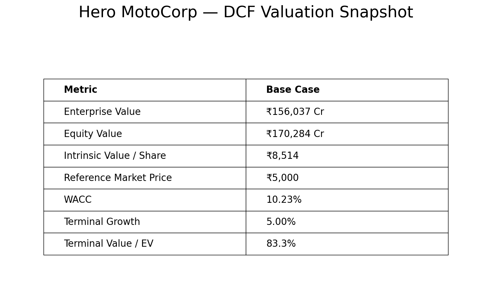
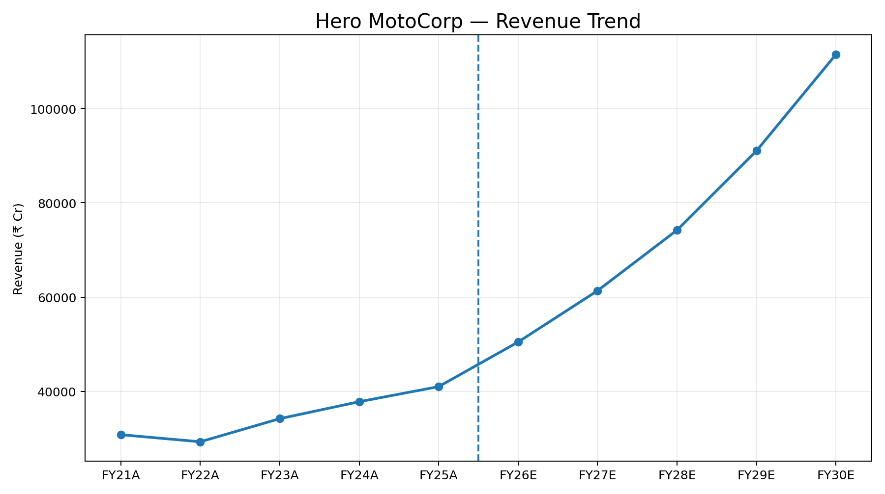
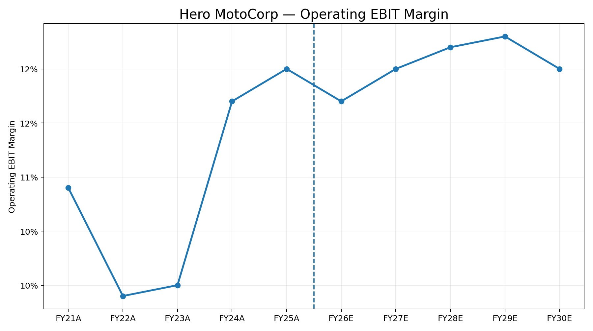
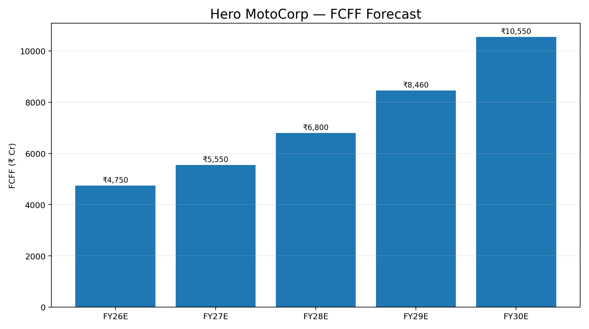
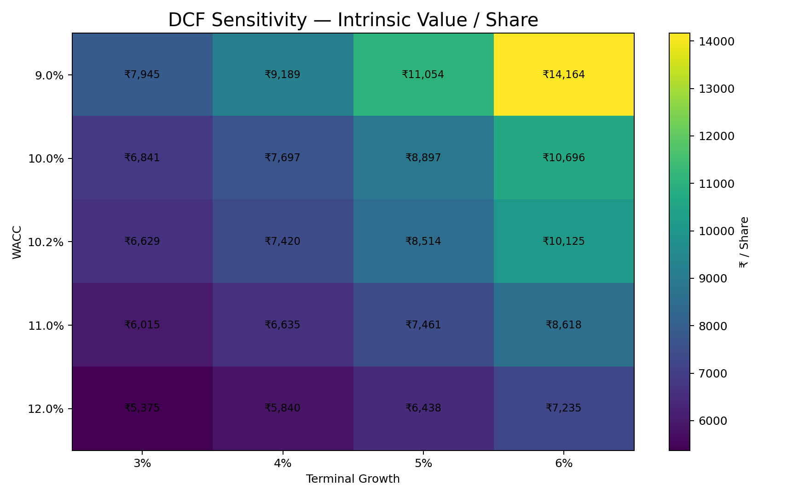
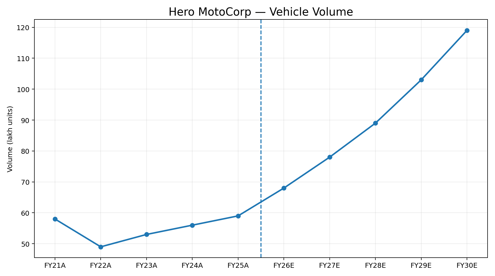

# Hero MotoCorp — Integrated DCF Valuation Model

An integrated financial modelling and discounted cash flow (DCF) valuation project for Hero MotoCorp.

## Project Overview

This model links historical financial statements with operating assumptions and a five-year forecast to estimate Hero MotoCorp's intrinsic equity value using a FCFF-based DCF approach.

The workbook includes:

- Historical and forecast revenue modelling
- Operating EBIT and profitability forecasting
- P&L, Balance Sheet and Cash Flow Statement schedules
- Working-capital and capex/depreciation schedules
- Free Cash Flow to Firm (FCFF)
- WACC calculation
- Enterprise-to-equity value bridge
- DCF sensitivity analysis
- Integrated model checks

## Base-Case Valuation

| Metric | Base Case |
|---|---:|
| Enterprise Value | ₹156,037 Cr |
| Equity Value | ₹170,284 Cr |
| Intrinsic Value / Share | ₹8,514 |
| Reference Market Price | ₹5,000 |
| WACC | 10.23% |
| Terminal Growth | 5.00% |
| Terminal Value / EV | 83.25% |
| Model-implied upside vs. reference price | 70.3% |

> The valuation figures above are outputs of the model's stated assumptions. They are not a recommendation to buy or sell the security.

## Forecast Horizon

The explicit forecast period runs from FY26E to FY30E.

Key forecast outputs:

| ₹ Cr | FY26E | FY27E | FY28E | FY29E | FY30E |
|---|---:|---:|---:|---:|---:|
| Revenue | 50,468 | 61,363 | 74,217 | 91,046 | 111,500 |
| Operating EBIT | 5,982 | 7,387 | 9,047 | 11,249 | 13,931 |
| Net Profit | 5,051 | 6,254 | 7,670 | 9,550 | 11,836 |
| CFO | 6,658 | 7,662 | 9,220 | 11,289 | 13,769 |
| Capex | 1,072 | 1,118 | 1,212 | 1,320 | 1,422 |
| Closing Cash | 5,896 | 12,371 | 20,307 | 30,203 | 42,477 |

## DCF Methodology

The model values the operating business using FCFF:

**FCFF = EBIT × (1 − Tax Rate) + D&A − Capex − Change in NWC**

The resulting forecast FCFF is discounted using WACC.

Terminal value is calculated using the Gordon Growth approach:

**Terminal Value = FCFFₙ₊₁ / (WACC − Terminal Growth)**

Enterprise value is then converted into equity value through the model's cash, debt and other balance-sheet adjustments, followed by division by the stated share count.

## WACC

The base-case WACC is **10.23%**.

The model includes assumptions for:

- Risk-free rate
- Beta
- Equity risk premium
- Cost of equity
- Cost of debt
- Tax rate
- Capital structure

The WACC sheet contains the calculation.

## Sensitivity Analysis

The model tests intrinsic value per share across different combinations of:

- WACC: 9.0%–12.0%
- Terminal growth: 3.0%–6.0%

The sensitivity table demonstrates how strongly DCF valuation depends on discount-rate and terminal-growth assumptions.

## Workbook Structure

| Sheet | Purpose |
|---|---|
| Executive Summary | Key valuation outputs and model overview |
| Revenue Model | Historical and forecast operating/revenue drivers |
| Assumptions | Core modelling assumptions |
| Schedules | Supporting operating and financial schedules |
| P&L | Historical and forecast income statement |
| Balance Sheet | Historical and forecast balance sheet |
| CFS | Cash flow statement |
| FCFF | FCFF calculation and DCF inputs |
| WACC | Weighted average cost of capital |
| Model Checks | Reconciliation and integrity checks |
| DCF Sensitivity | WACC / terminal-growth sensitivity |

## Model Quality Checks

The final workbook was recalculated and checked for:

- Broken Excel references
- Formula errors
- Forecast balance-sheet reconciliation
- Cash-flow reconciliation
- FCFF linkage
- WACC calculation
- Enterprise-to-equity value bridge
- Share-count linkage
- Sensitivity-table consistency

No formula-error cells were identified in the final checked workbook.

## Important Limitations

This is an academic/portfolio financial modelling project, not an investment recommendation.

The model contains historical source-data discrepancies that are disclosed in the workbook rather than silently overwritten. In particular:

- Historical Balance Sheet discrepancies exist for FY24 and FY25.
- Historical D&A differs from the supporting schedule for FY22 and FY23.
- These disclosed historical differences do not create a forecast formula error; the forecast model checks reconcile.

Market-sensitive assumptions such as the risk-free rate, beta, equity risk premium and reference price should be independently refreshed before using the model for a live investment decision.

## Repository Contents

```text
Hero-MotoCorp-DCF/
│
├── Hero_MotoCorp_DCF_Model.xlsx
├── README.md
├── MODEL_METHODOLOGY.md
├── ASSUMPTIONS_AND_LIMITATIONS.md
├── MODEL_CHECKS.md
├── VALUATION_SNAPSHOT.md
├── .gitignore
└── LICENSE
```

## Disclaimer

This project is for educational and portfolio purposes only. It demonstrates financial modelling, valuation and sensitivity-analysis techniques. It should not be interpreted as investment advice or a recommendation regarding Hero MotoCorp or any other security.


## Visual Outputs

### Valuation Snapshot


### Revenue Trend


### Operating EBIT Margin


### FCFF Forecast


### DCF Sensitivity


### Vehicle Volume


## Report

A PDF version of the analysis is included as `Hero_MotoCorp_DCF_Analysis_Report.pdf`.
